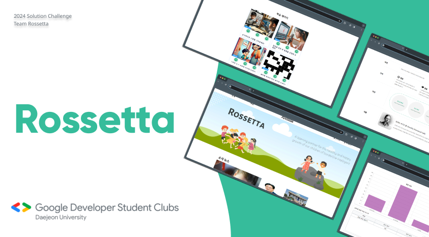
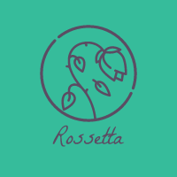
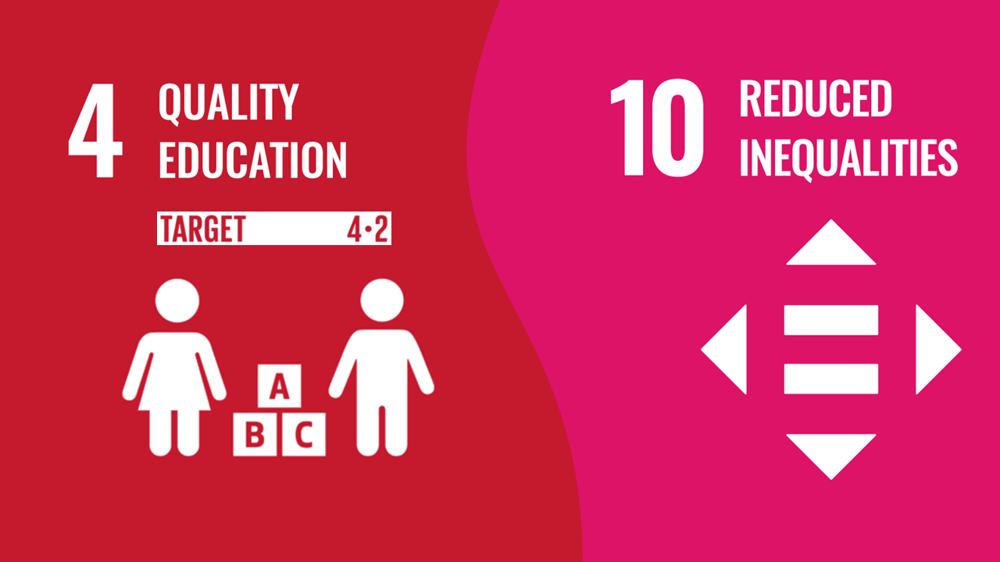
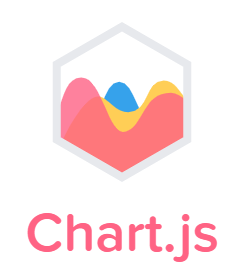
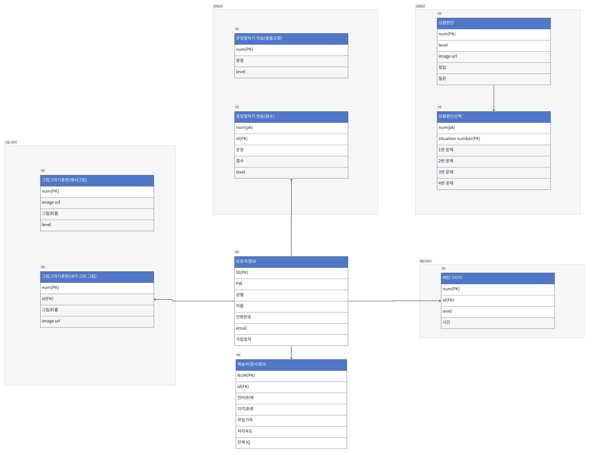
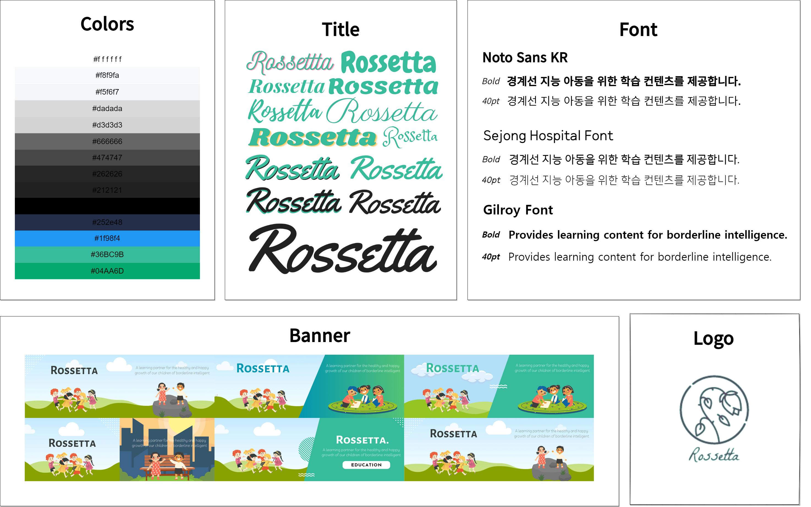
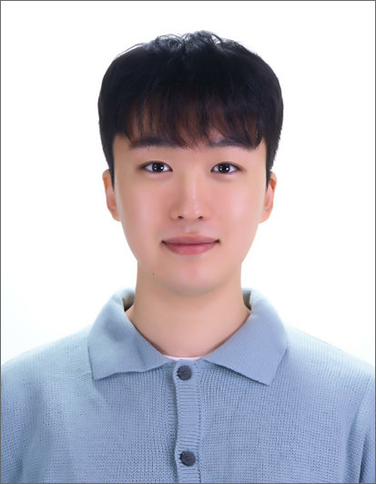
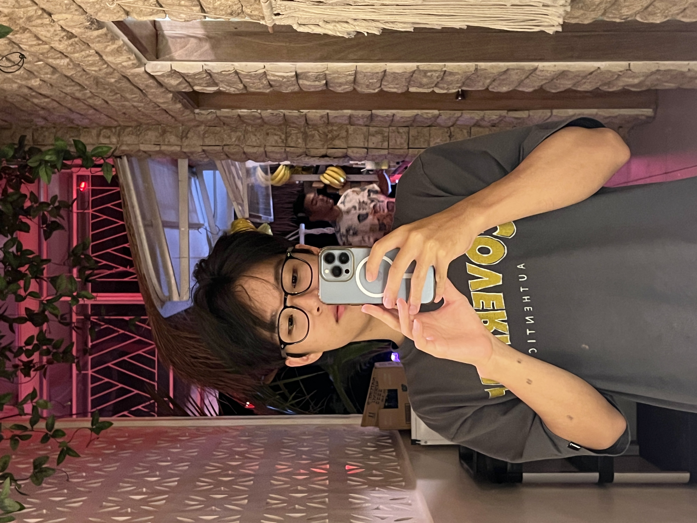
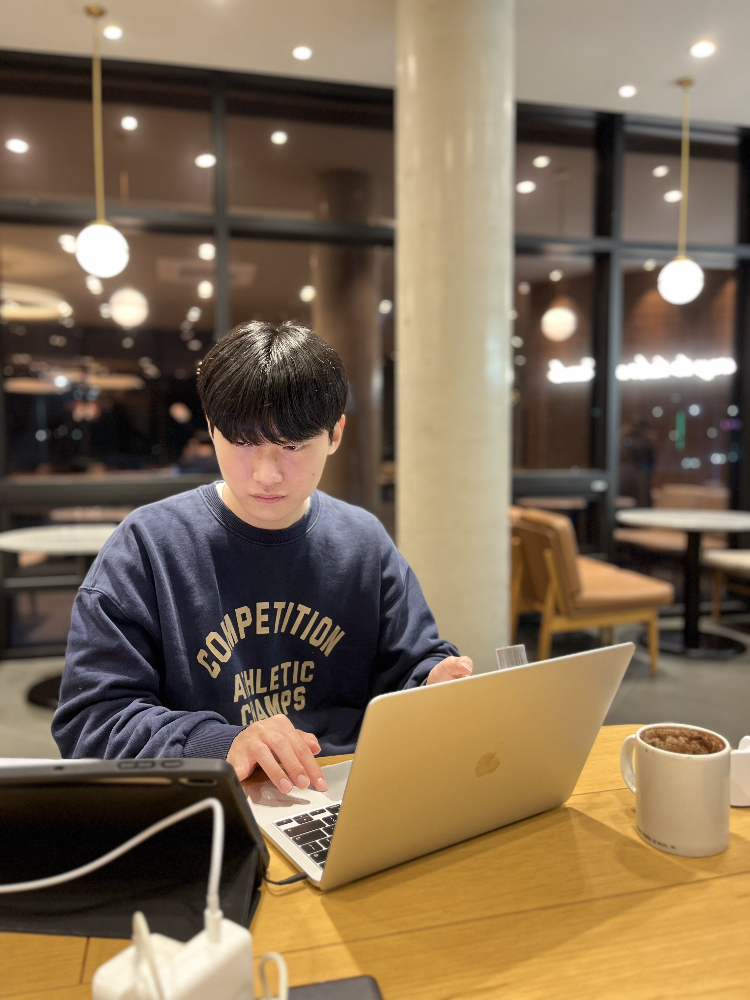
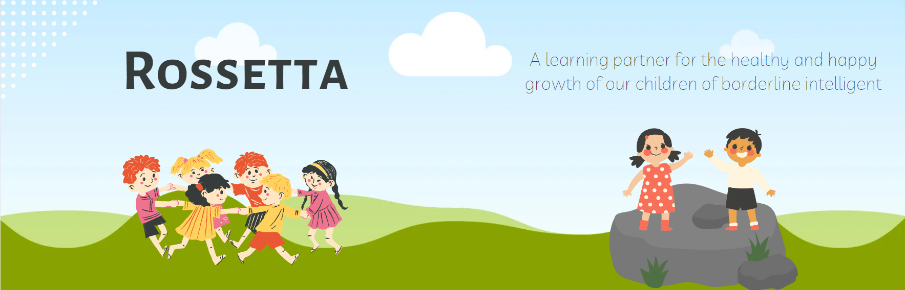

<div align="center">
    <h1>Rosetta Index</h1>
</div>

- [Rosetta Introduction](#rosetta-platform-for-children-with-borderline-intelligence)
- [Problem Statement](#problem-statement)
- [🎯 SDG](#🎯-uns-sustainable-development-goals--targets)
  * [Goal 4(Target: 4.2)](#goal-4-quality-education-target-42)
  * [Goal 10](#goal-10-reduced-inequalities)
- [💻  Technology Stack](#💻-technology-stack)
- [✔  Project Architecture](#✔-project-architecture)
- [🛠  Entity Relationship Diagram](#🛠-entity-relationship-diagram)
- [🎞 Demo Video](#🎞-demo-video)
- [🌊  Rough Configuration](#🌊-rough-configuration)
- [✏  Learning Descriptions & Expected Effects](#✏-learning-descriptions--expected-effects)
- [🗂  Directory structure](#🗂-directory-structure)
- [📌  Getting Started](#📌-getting-started)
  * [How to access URL](#how-to-access-url)
  * [How to run a project](#how-to-run-a-project)
- [🎨  Design Board](#🎨-design-board)
- [👨‍💻  Contributors](#👨‍💻-contributors)


# Rosetta: Platform for children with borderline intelligence
<div align="center">
    
</div>

Rosetta is an educational solution for children with borderline intelligence. Customized training provided by Rosetta allows users to improve their cognitive, language, visual perception, and other intellectual abilities and visually check their ability growth through learning outcomes.

<table>
<tr><td></td><td> <b> Rosetta Sherwood Hall </b> </br> After coming to Korea in 1890, Rosetta Sherwood Hall served as a missionary for 44 years, focusing mainly on welfare, education, and medical services for women and the disabled. Rosetta Hall began the first modernized special education in Korea. </td></tr>
<tr><td>  </td><td> <b> Snow Drop </b> </br> Seolganghwa with the meaning of flower words such as hope and solace It means, "I look forward to the spring of hope for everyone to open up their shrunken bodies and minds like Seolganghwa, which broke through the frozen ground in the cold." </td></tr>
</table>


## Problem Statement
<br/>
<blockquote align='center'>  
<h3> “In Korea, about 7 million people have people with borderline intelligence” </h3>
</blockquote>
<br/>

Rossetta is trying to solve various problems facing 7 million people in the estimated population of Borderline Intelligence in Korea. Adults with border intelligence have great difficulties in social life. In particular, there is a lack of institutional support and most of the education and support services are concentrated in the metropolitan area, so the **regional imbalance** is serious. This makes it very difficult for people with borderline intelligence and disabilities living in rural areas to receive education and support services.

In addition, while it is very important for children with border intelligence to receive effective early treatment and education, the cost of education for this is very high, at more than W10 million per year, which is **economic burden***. It is one of the main obstacles preventing many families from getting the education and support they need.

Our service is focused on recognizing these issues and helping children with borderline intelligence and families overcome barriers to economic and accessibility issues. Through this, we want to build a **more comprehensive and accessible education system** and help children with borderline intelligence reach their full potential.


## 🎯  &nbsp;UN's Sustainable Development Goals & Targets

<div align="center" >
    
</div>

### Goal 4: Quality Education (Target: 4.2)

Rossetta helps early child development to prepare for **primary education**.

We provide customized online learning programs for children with borderline intelligence so that they can develop their cognitive, spatial, and linguistic abilities comprehensively. These educational programs help children have the basic necessary preparations for primary education so that every child has the opportunity to reach their full potential through education.

### Goal 10: Reduced Inequalities

Rossetta's learning service allows all children, regardless of their geographic location, to access educational resources. It provides important opportunities, especially for children living outside of the Seoul metropolitan area.

Our services reduce the financial burden, making it easy to provide to children from more families. This reduces the **economic gap** by allowing children from low-income families to also benefit from education.

Through Rossetta's learning service, we will help children with borderline intelligence improve their intellectual abilities in a variety of ways, including cognition, language, and visual perception, through customized education. This will lay the groundwork for them to actively participate in various areas of society **reduce regional and economic inequality**.

## 💻  Technology Stack

<div align="center">
<kbd>

</kbd>
<kbd>

</kbd>
<kbd>

</kbd>
<kbd>

</kbd>
<kbd>

</kbd>
<kbd>

</kbd>
<kbd>

</kbd>
<kbd>

</kbd>
<kbd>

</kbd>
</div>

<div align="center">
<h4>React | React Hooks | Express.js | MySQL | GCP | MedaiPipe | ETRI API | Chart.js | Styled Components </h4>
</div>


## ✔  Project Architecture

<div align="center" >
    
</div>

## 🛠  Entity Relationship Diagram

<div align="center" >
    
</div>

## 🎞 Demo Video

[](https://www.youtube.com/watch?v=H9LvbVILIwI)

## 🌊  Rough Configuration


## ✏  Learning Descriptions & Expected Effects


<div align="center" >
    <h2> 1. Motion Drawing </h2>
    
</div>

### Learning Introduction
- This learning draws on the screen by recognizing the fingers on the camera. This activity, by following level-specific example images provided next to them (e.g., a puppy), fosters visual perception abilities, fine motor skills, creativity, and imagination, and enhances concentration and patience.

### How to Use
- Drawing mode: Draw only with the index finger.
- Eraser mode: Use only the index finger and middle finger to clear the canvas.
- Download or save the picture you drew to My Gallery.


<div align="center" >
    <h2> 2. Pronunciation Correction </h2>
    
</div>
    
### Learning Introduction

- The learning speaks example sentences and provides a pronunciation score. This activity helps train language skills, improve pronunciation, accelerate language acquisition, listening and speaking skills, and language confidence.

### How to Use
 
- Random Sentence Button: A new sentence is provided.
- Record Button: Press the button, read the sentence into the microphone, and then press the button again.
- After recording, a pronunciation score is provided.


<div align="center" >
    <h2> 3. Situational Awareness </h2>
    
</div>

### Learning Introduction

- This learning looks at the picture of the situation presented and chooses the right one, between which situation. This activity helps improve situational awareness, critical thinking, language understanding, and communication skills.
    
### How to Use

- Look at the picture on the left and choose what the situation is like.
- The score comes out when the question is over.


<div align="center" >
    <h2> 4. Pattern Matching </h2>
    
</div>

### Learning Introduction

- This is a learning that looks at the presented pattern on the left and fits the pattern equally on the right. This activity helps improve spatial perception, visual attention, problem-solving abilities, and memory.
    
### How to Use
 
- View the pattern on the left and click the same pattern in the empty spaces on the right, then press the submit button.
- The time to match the pattern is recorded.


## 🗂  Directory structure

```
│.gitignore
├─🗃️backend
│   ├─package.json
│   ├─package-lock.json
│   ├─server.js
│   ├─🗂️contllers
│   ├─🗂️middlewares
│   ├─🗂️models
│   ├─🗂️routes
│   └─🗂️img
└─🗃️frontend
    │package.json
    │package-lock.json
    ├─🗂️public
    │  └─📁assets
    └─🗂️src
       ├─📁components
       ├─📁pages
       ├─📁styles
       ├─app.js
       ├─index.js
       └─index.css

```

## 📌  Getting Started

### How to access URL

📢 **There is something you need to do before accessing our website!**

1. Run the Chrome browser on the Client and enter **"[chrome://flags](chrome://flags)"** in the address bar
2. Enter **“Insecure origins treated as secure”** in the search field at the top.
3. **Enter the IP** to connect **(http://35.208.138.116:3000)**, enable it, and **restart the browser**.
4. If you connect to the server address again, you can confirm that the camera and audio have permission.

**Please enter the ID and password below after accessing this [Rossetta](http://35.208.138.116:3000/)**
```
id: rosseta
pw: rossetta1865!
```

### How to run a project

⚠ **For pronunciation correction learning, an ETRI API key is required. Please try accessing pronunciation correction learning via an IP (http://35.208.138.116:3000)**.

**Clone Project**
```bash
git clone https://github.com/GDSC-DJU/24SolChl_Rossetta.git
cd ./24SolChl_Rossetta
```

**Install Package**
```bash
# Go to frontend folder
cd ./frontend

# Download of node_modules in React
npm ci

# Move from frontend folder to backend folder
cd ../backend

# Download of node_modules in Express
npm ci
```

**Start Project**
```bash
# start (When you npm start in the backend folder, the frontend folder also runs.)
npm start
```

## 🎨  Design Board


## 👨‍💻  Contributors

|  |  |  |  |
| --- | --- | --- | --- |
| <div align="center"><h3><b><a href="https://github.com/ray9583">Kim Jinwo</a></b></h3><p><i>Daejeon University</i></p></div> | <div align="center"><h3><b><a href="https://github.com/LeeHongyo">Lee Honggyo</a></b></h3></a><p><i>Daejeon University</i></p></div></a> | <div align="center"><h3><b><a href="https://github.com/EOTAEGYU">Eo Taegyu</a></b></h3></a><p><i>Daejeon University</i></p></div> | <div align="center"><h3><b><a href="https://github.com/seok019283501">Choi Minseok</a></b></h3></a><p><i>Daejeon University</i></p></div> |



